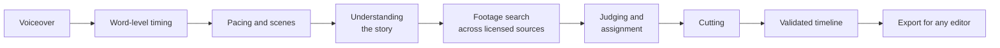

# How Vocravox is built

Vocravox turns a voiceover into a word-synced, relevant stock-footage timeline and exports it as numbered
clips for any video editor. It is a desktop product (Windows today, Mac planned) that runs entirely on the
user's computer, installs like any other app, and is built and maintained by one developer.

This page is for people who want to know *how* it works and *how well* it is engineered. The source code is
proprietary and private; everything below describes the design and the measured results.

- [The problem](#the-problem)
- [The pipeline](#the-pipeline)
- [Architecture](#architecture)
- [Decisions that shaped it](#decisions-that-shaped-it)
- [Performance, measured](#performance-measured)
- [Reliability](#reliability)
- [Shipping it: installer, setup and updates](#shipping-it-installer-setup-and-updates)
- [Quality engineering](#quality-engineering)
- [Privacy and licensing](#privacy-and-licensing)
- [By the numbers](#by-the-numbers)
- [What is not done yet](#what-is-not-done-yet)

## The problem

A faceless-video creator records (or generates) a voiceover, then spends hours finding a clip for every line,
cutting it to length and lining it up with the words. Existing "script to video" tools either lock the result
inside their own editor or pick footage by keyword, so a line about a winter blackout can come back with
outer-space footage.

Vocravox does the assembly and nothing else: it finds footage that actually fits each line, cuts every clip to
the exact length of the words it covers, and hands the result to the editor the creator already uses.

## The pipeline



Premium AI models do the perceptual work; the engine around them decides what to do with it. In outline:

1. **Timing.** The audio is processed locally into word-level timestamps. These timings are the single source of
   truth for everything that follows: nothing is ever timed from the script.
2. **Pacing.** Words are grouped into scenes. Cut length depends on where the line sits in the video and on the
   pace the user picked.
3. **Understanding.** The whole script is read before any footage is chosen, so every later decision is made
   in the context of the story. With no AI key available, a local fallback keeps the video coming.
4. **Search and judging.** Licensed sources are searched in parallel, with quota tracking and automatic failover.
   Candidates are then judged on the user's own computer for how well the picture itself fits the line, and
   assigned in order so nothing repeats and the opening gets first pick.
5. **Cutting.** Only the winners are downloaded. Each starts at its best moment, and unused material is reused
   under rules that avoid visible loops.
6. **Timeline.** A complete timeline document is produced and validated against a JSON Schema.
7. **Export.** Clips are pre-cut to contiguous lengths that add up to the narration, so dropping them into an
   editor in number order lines up with the voice with no manual trimming. Captions, a ready-built editor
   timeline, a credits file and an optional zip complete the folder.

Public figures, places and events named in a script get real, freely licensed photos instead of generic footage.

**What is original here.** The models are premium, pre-trained ones, used as components. The engine around them
is original work: the pacing logic, the story understanding, the judging and assignment rules, the cutting and
reuse rules, the timeline contract, the measured export, and the setup and update system described below. That
engine, and the reliability it adds, is what the rest of this page is about.

## Architecture

```
Electron shell ──starts──▶ local engine (Python, FastAPI) ◀──HTTP──▶ React + TypeScript UI
 setup, updates,              pipeline, jobs, export                  create, review, edit, export
 diagnostics                  compiled to native code                 served by the engine itself
```

- **Local-first.** The engine listens on `127.0.0.1` only and refuses requests for any other host name. There is
  no account and no server of ours in the loop.
- **One contract between stages.** The timeline is a versioned, schema-validated document. The pipeline writes
  it, the editor reads and edits it, and the exporter consumes it, so each part can change independently.
- **Jobs, not requests.** Generation runs as a background job with step-by-step progress, so the UI can show what
  is happening and survive long videos (tested with half-hour voiceovers).
- **Desktop shell.** A small shell handles first-run setup, starts and stops the engine (the engine also exits on
  its own if the shell crashes), shows the UI in its own window, checks for updates and offers one-click
  diagnostics with API keys removed.

## Decisions that shaped it

**Audio first.** Timing comes from the real voice, word by word. Script-to-video is deliberately held back
("coming soon") until it can ship with natural voices, because a robotic placeholder voice is not the quality
bar and replacing a voice later would break the sync. Protecting the sync is the product's core promise.

**Relevance over speed.** A fast video with wrong clips is worthless. Time is spent where it improves the match
(theme understanding, frame scoring, de-duplication) and saved elsewhere (parallel search, downloading only
winners, caching).

**Bring your own keys, free tiers only.** The product never needs a paid service. Providers fail over, and every
AI step has a local fallback, so a missing or exhausted key degrades quality instead of stopping the job.

**Commercial-safe by construction.** Footage comes only from sources and licences that allow commercial use.
Photo searches are filtered with an allow-list of licences, and every export carries a `CREDITS.txt` ready for
the video description. A bug that let non-commercial images through was found, fixed and covered by a test.

**Hand off, don't compete with editors.** Export is a plain folder plus a timeline file that DaVinci Resolve and
Premiere can import. Creators keep their tools; Vocravox removes the tedious hours.

## Performance, measured

**Export speed on laptops.** A user reported that export was fast on the development PC but slow, and sometimes
produced an empty folder, on a laptop with integrated graphics. Investigation showed the cause was not slow
hardware but a bad rule: "use the first hardware encoder that works". Intel Quick Sync takes about 1.5 seconds
to start for every clip, and clips are only about 3 seconds long, so on 60 clips it lost to the plain processor.

The fix replaces the rule with measurement. At start-up (in the background) the engine runs the real workload
through every encoder and ranks them by clips per second, with a small bonus for hardware because it leaves the
processor free. The ranking is cached for a week, keyed to the video toolkit build and the CPU.

| 60-clip export on the development PC | Time |
|---|---|
| Intel Quick Sync (the old first choice) | 47 s |
| Processor | 29 s |
| Measured choice (NVIDIA encoder) | 21 s |

Other costs removed along the way: the zip is built only on request (it copied every clip a second time); the
export runs at low priority with no console windows, so the PC stays responsive; speech recognition on the
processor uses all useful cores instead of a library default of four.

**First-video latency.** The models the product needs are downloaded during setup, not on the first video, with
exact progress, resume after an interruption and no second download on reinstall or update (see below).

## Reliability

Most of the engineering effort goes into what happens when things go wrong.

- **A held-up video tool is detected and handled.** On start-up the engine asks the video tool for half a second
  of nothing. If it does not answer, it retries one thread at a time (security software can hang a tool that
  starts many threads) and runs in that safe mode; if even that fails, the Create page says so up front with the
  folders to allow and a Check again button, and an export stops in seconds with the same advice instead of
  grinding through hundreds of timeouts.
- **A failing encoder never costs the export.** A clip that fails on one encoder moves to the next in the ranked
  list; an encoder that fails twice is dropped for the session; the last resort always works. Failures are logged
  with the toolkit's own message instead of being discarded.
- **No silent success.** Every produced clip is validated. If none could be made the export fails with a clear
  error, and clips that had to become black filler are counted and reported.
- **Honest progress and control.** Export reports real progress and time left, can be cancelled, and refuses a
  second export of the same project while one is running.
- **Fail fast on AI errors.** A dead model or bad key is detected on the first call and the user is told which
  provider and why, instead of the job retrying hundreds of times and quietly producing generic footage. The app
  can look up which models a provider currently offers and pick a working one.
- **Graceful degradation everywhere.** No AI key, an exhausted quota, a source that is down, no graphics card, a
  slow connection: each has a defined fallback and a visible note, and none crashes a job.
- **Resumable downloads.** An interrupted first-run download continues from where it stopped; if it cannot finish
  the user can retry or continue and let the first video fetch what is missing.

## Shipping it: installer, setup and updates

- **Normal Windows installer**, per-user, no administrator prompt, about 180 MB. The engine is compiled to native
  code, so no source or documentation strings are shipped. The bundled video toolkit is an LGPL build with no GPL parts.
- **First-run setup adapts to the computer.** It detects an NVIDIA card and driver version, offers Full (local
  visual check) or Lite, and downloads exactly the pinned package versions that machine needs from a lock file.
  Packages and models share one progress bar with time left, and a free-disk-space check runs before large
  downloads.
- **Incremental by design.** Models live in the data folder, which reinstalling and updating keep. Setup skips a
  model that is already present without touching the network, downloads one that is missing, and continues one
  that was interrupted. A revision number lets a future version fetch only a model it adds.
- **Updates** are checked at start. A downloaded update installs on restart or when the app closes. If an update
  changes the required packages, the app updates them automatically with the user's previous Full or Lite choice.
- **Supportable.** One menu command copies diagnostics (system, setup and engine logs) with keys removed, and the
  setup log keeps the raw install output.
- **Release pipeline.** Pushing a version tag builds the installer on a clean Windows machine and uploads it as a
  draft release; a human installs it on a clean PC and makes a real video before publishing.

## Quality engineering

- **Tests at every layer.** 257 backend tests, 12 frontend tests and 7 desktop-shell tests. Export tests run a
  real video toolkit on real clips and check the output files, not mocks.
- **Continuous integration.** Every push runs, on a clean Linux machine: the lock-file consistency check, a
  frozen install of exact dependency versions, lint, and the full test suite; and for the interface: install,
  lint, tests, a type-check (unused code is an error) and a production build.
- **Guard tests for invariants.** The version number must agree across five files; the first-run models revision
  must match between shell and engine; the timeline schema is checked; and no model or library name may appear in
  any message a user can see.
- **Tests never touch real data.** After an early incident where a test run overwrote a developer's saved
  settings, tests run against isolated data folders, enforced by shared fixtures.
- **Reproducible builds.** Dependencies are pinned to exact versions in a lock file; the installer downloads those
  versions, not "latest".
- **Design system.** A consistent glass-style interface with light and dark themes and smooth, restrained motion.

## Privacy and licensing

- Audio, keys, projects and downloaded footage stay on the user's computer. Keys are stored locally and masked in
  the interface and the settings API.
- Only search words (to the stock libraries) and script text (to the AI providers the user turns on) leave the
  machine. See [PRIVACY.md](PRIVACY.md).
- Third-party components and their licences are listed in the app under Help, Licenses.

## By the numbers

| | |
|---|---|
| Source and tests | about 13,000 lines (engine 5,900, engine tests 4,400, interface 2,200, desktop shell 900) |
| Automated tests | 276 (257 engine, 12 interface, 7 shell) |
| History | 116 commits since 13 September 2026, built and maintained by one developer |
| Installer | about 180 MB; first-run downloads 1 to 6.6 GB depending on the computer and Full or Lite |
| Export of 60 clips | 21 s on the development PC, down from 47 s |
| Stock sources | 4, filtered to commercial-use licences |
| Platforms | Windows today; Mac (Apple Silicon) planned |

## What is not done yet

Honest list:

- **Code signing.** The installer is not signed yet, so Windows shows "Windows protected your PC" on first run
  (choose More info, then Run anyway). A certificate comes before a wide launch.
- **Script to video.** Held back until it can ship with natural voices; today only voiceover uploads start a project.
- **Mac.** Planned for Apple Silicon; not built yet.
- **Reopening an old project.** Exports are kept on disk, but the app cannot yet reopen a past job for editing.
- **Visual verification by an online AI** is optional and off by default because free tiers rate-limit.

Questions, feedback or a conversation about the engineering: [open an issue](https://github.com/Farhaal/vocravox/issues/new/choose).
