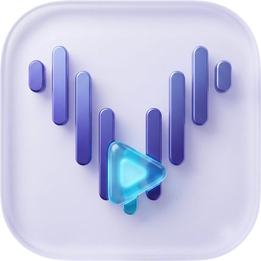
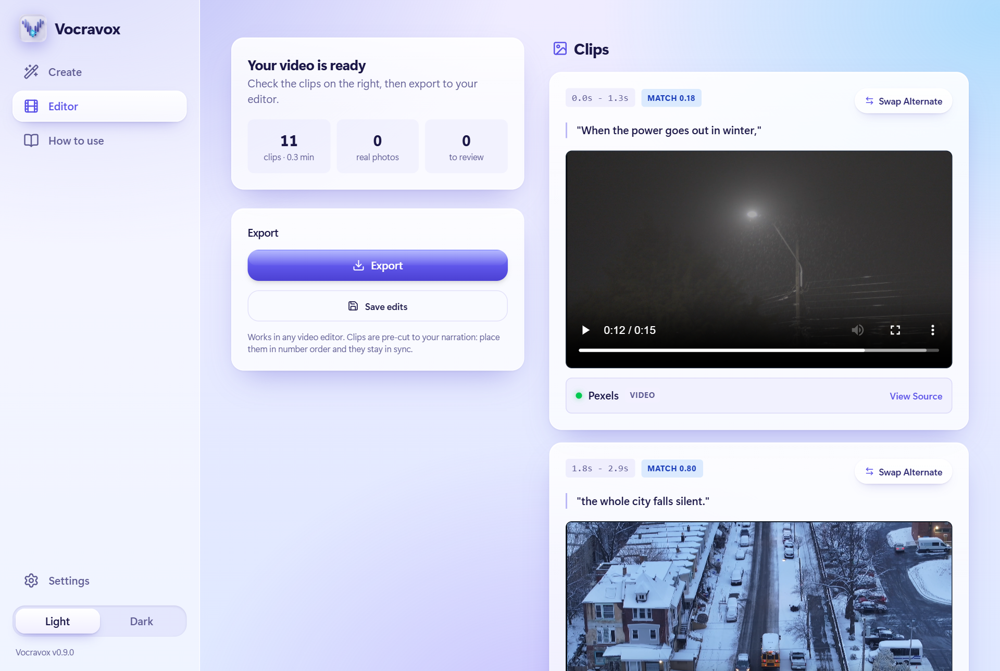
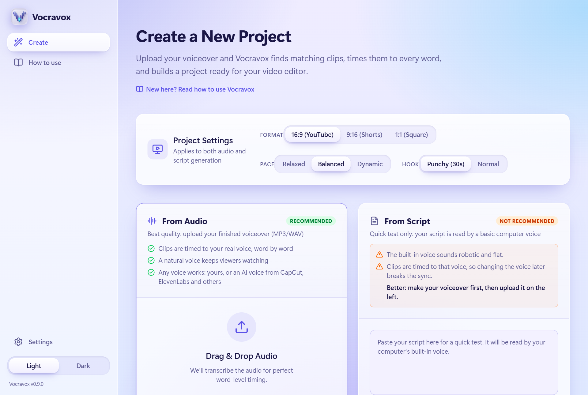
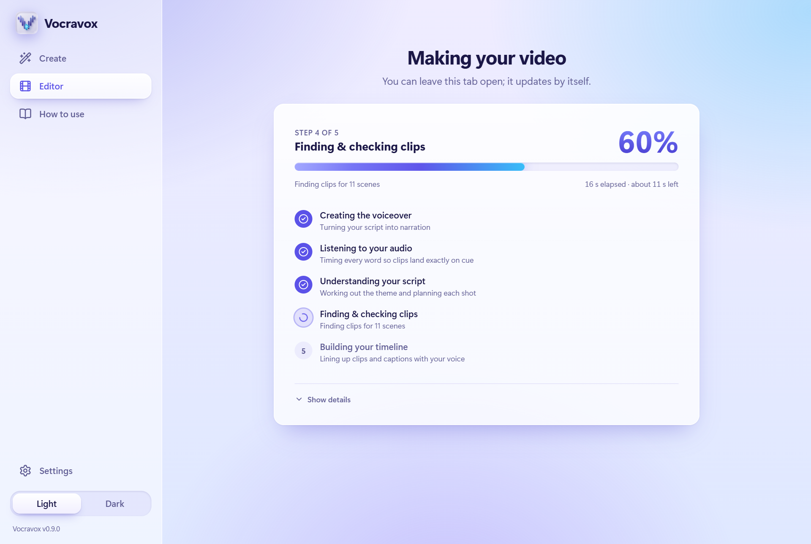

<!--
  Public product page. Published to the PUBLIC releases repository (no source code there).
  Before publishing, create the public repo Farhaal/vocravox and add the screenshots listed in
  release/README.md (assets/screenshot-editor.png, screenshot-create.png, screenshot-progress.png).
-->

  

<h1 align="center">Vocravox</h1>

  <b>Turn your voiceover into a ready-to-edit video.</b> 
  A matching clip for every line, cut to the exact length of your words, ready for any editor.

  <a href="https://github.com/Farhaal/vocravox/releases/latest"><b>Download for Windows</b></a> ·
  <a href="https://vocravox.com">Website</a> ·
  <a href="ENGINEERING.md">How it is built</a>

  
  
  
  

  

## What it does

1. **Upload your voiceover**: your own voice or any AI voice.
2. **Vocravox builds the video**: it listens to every word, understands what your script is about,
   and finds a matching stock clip or real photo for each line.
3. **Export to your editor**: numbered clips already cut to your narration, plus captions, for
   CapCut, DaVinci Resolve, Premiere Pro or any other editor.

A 30 to 60 second voiceover is a good first try. Half-hour narrations work too.

## Why creators use it

- **Clips that fit the story.** It reads your whole script first, so a line about a winter blackout
  gets snow and dark streets, not outer space.
- **Perfect timing.** Every cut lands on the word it belongs to, because timing comes from your real voice.
- **Real photos of real things.** Named people, places and events get real, freely licensed photos.
- **Commercial-use footage.** Clips and photos come only from sources whose licenses allow commercial
  use, with a credits file ready for your video description.
- **No repeated footage.** Clips are not reused across the video, and the opening gets the best picks.
- **Fast on your own computer.** It tests your hardware and uses whatever is quickest, a graphics card when
  it helps and your processor when it doesn't.
- **Private.** Everything runs on your computer. Your audio never leaves it.
- **Free.** No account, no watermark, no subscription.

## Install

1. [Download the installer](https://github.com/Farhaal/vocravox/releases/latest) (about 180 MB) and run it.
   It installs for your user only, with no administrator prompt.
2. **Windows may say "Windows protected your PC"** because the installer is not code-signed yet. Choose
   **More info**, then **Run anyway**.
3. On first launch Vocravox detects your computer and downloads the parts it needs, once, with one progress
   bar. Choose **Full** (best matching: it checks each clip's picture on your computer) or **Lite** (smaller).

   | Your computer | Full | Lite |
   |---|---|---|
   | Windows with NVIDIA graphics | about 6.6 GB | about 2.1 GB |
   | Windows without NVIDIA | about 3.2 GB | about 1.0 GB |

4. Add your free keys in Settings (Pexels and Pixabay for video clips, plus an AI key such as Google
   Gemini). The app shows where to get them; it takes about five minutes.

Reinstalling or updating never downloads those parts again, and uninstalling keeps your projects and
settings. Interrupted downloads continue where they stopped.

## Requirements

| | Minimum | Recommended |
|---|---|---|
| Windows | Windows 10 or 11, 64-bit, 8 GB RAM | NVIDIA graphics card, 16 GB RAM |
| Mac | Planned: Apple Silicon (M1 or newer), macOS 14 | |
| Disk | 10 GB free | 30 GB free |
| Internet | Needed to find footage | |

## Screenshots

  
  

## For the technically curious

The source code is private, but how it works is not a secret. [ENGINEERING.md](ENGINEERING.md) covers the
pipeline, the architecture, and the measured results behind the decisions: for example how a rule of
"use the graphics encoder" turned out to be 2.2 times slower than measuring the computer and picking the
fastest option, and how setup downloads are resumable and never repeated.

## FAQ

**Is it free?** Yes, the current version is free to use, including for monetized videos.

**Do I need a powerful PC?** No. It runs on any modern computer; a graphics card makes it faster.

**Which editors work?** Any. The export is a folder of numbered clips, your narration and captions.
DaVinci Resolve and Premiere Pro can also import a ready-built timeline.

**Where do the clips come from?** Pexels, Pixabay, Openverse and Wikimedia Commons, filtered to licenses
that allow commercial use. See `CREDITS.txt` in every export.

**What leaves my computer?** Only search words (to the stock libraries) and your script's text (to the AI
providers you turn on). Never your audio, your keys or your files. See [PRIVACY.md](PRIVACY.md).

**Why is the first video not instant?** The heavy work happens on your computer, so a long voiceover on a
basic laptop takes a while. The app shows live progress, and the models are downloaded during setup so
they never delay your first video.

**Export seems slow.** Vocravox tests your computer and uses the fastest option. The Export card shows
progress and time left, and you can cancel and try again later. If something looks wrong, use
**Help, Copy diagnostics** and send it with your report.

## Support

Found a bug or have an idea? [Open an issue](https://github.com/Farhaal/vocravox/issues/new/choose).
In the app, **Help → Copy diagnostics** adds the details needed to help (your keys are never included).

## License

Vocravox is free to use under the [End User License Agreement](LICENSE.md). It is proprietary
software: the source code is not public. Footage and photos belong to their creators and are used
under their licenses. See [PRIVACY.md](PRIVACY.md) for what leaves your computer.
